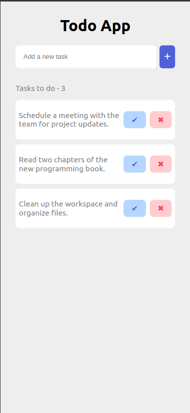
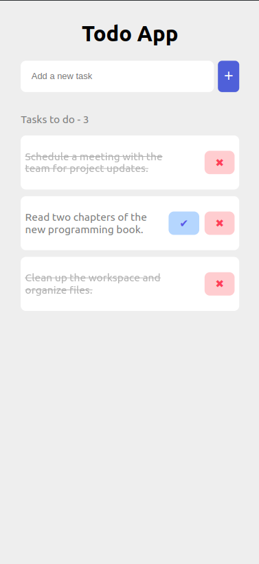
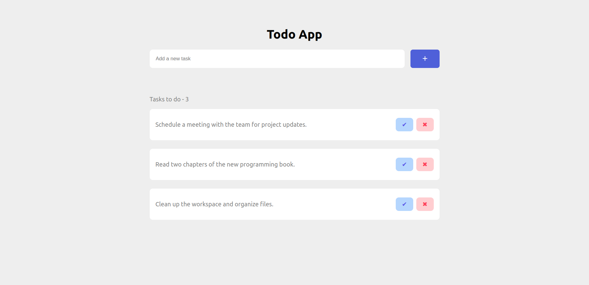
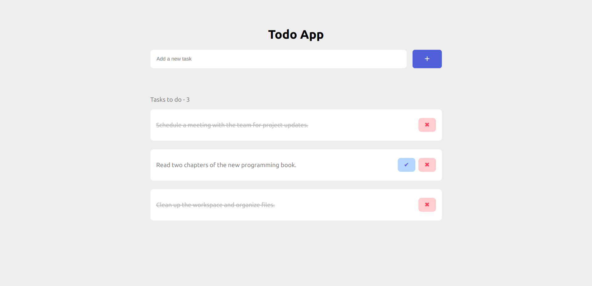

# Todo App - React

This is a simple React-based Todo App that allows users to add, mark as complete, and delete tasks. The project is modular, with components structured for clarity and maintainability.

## Features

- **Add Tasks:** Enter a task in the input field and add it to the list.
- **Mark as Complete:** Mark tasks as completed by clicking the check button.
- **Delete Tasks:** Remove tasks from the list with the delete button.
- **Task Count:** Displays the count of tasks to be completed.

## File Structure

1. **`App.js`:**

   - The main component that manages the application's state and renders `AddTask` and `TaskList` components.
   - Handles task addition and deletion.

2. **`AddTask.js`:**

   - A form component with an input field and a button to add tasks.
   - Uses a `useRef` hook to access the input field.

3. **`TaskItem.js`:**

   - Represents a single task with options to mark as completed or delete.
   - Uses a `useRef` hook for task manipulation (e.g., marking completed).

4. **`TaskList.js`:**

   - Displays a list of tasks using `TaskItem` components.
   - Shows the total number of tasks remaining.

5. **Styling (CSS):**
   - CSS files (e.g., `base.css`, `addTask.css`, `taskItem.css`, `tasklist.css`) are imported in their respective components for modular styling.

## How to Run

1. Clone the repository:

   ```bash
   git clone <repo-url>
   cd <repo-folder>
   ```

2. Install dependencies:

   ```bash
   npm install
   ```

3. Start app locally:

   ```bash
   npm start
   ```

4. Open app in your browser using default port `https://localhost:3000`

## Screenshots

Here are some screenshots of the Todo App:

### Mobile Version

 

### Desktop Version

 
